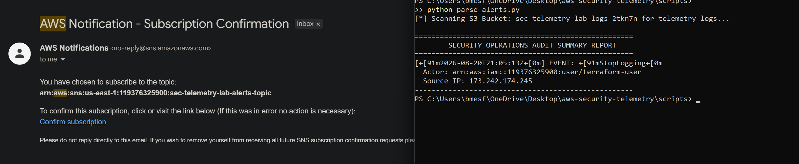
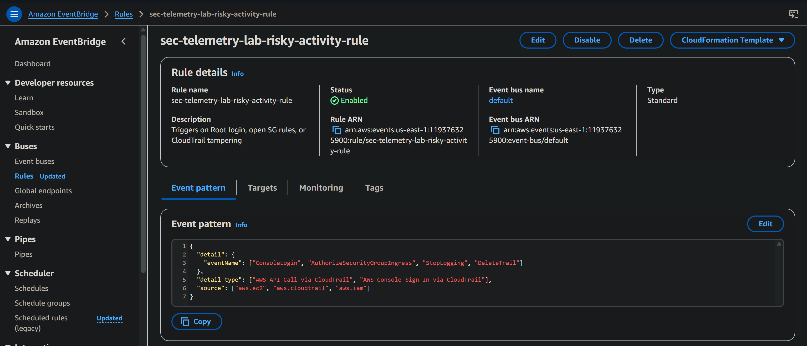

# AWS Security Telemetry Pipeline & Log Auditor

This project automates the deployment of a centralized logging and real-time security alerting system on AWS using HashiCorp Terraform. It also includes a custom Python command-line utility built with `boto3` that acts as a localized log auditor—automatically sifting through complex, compressed cloud logs to pull out evidence of security incidents.

My primary objective here was visibility and defensive monitoring. I wanted to build an infrastructure stack that functions as a security camera system for an AWS account, ensuring that if any high-risk changes happen or an attacker tries to cover their tracks, it is immediately caught, flagged, and summarized.

---

## Core Security Architecture

```text
[ Raw AWS Account Activity ]
             │
             ├──> AWS CloudTrail ────(Encrypted via KMS Keys)────> [ Secure S3 Log Vault ]
             │                                                           ▲
             ├──> AWS Config (Compliance Monitor & Drift Checks) ────────┘
             │
             └──> Amazon EventBridge (The Security Tripwire) ──> Amazon SNS ──> [ SOC Email Inbox ]
                                                                     │
                                                   Python Script ────┘
                                                   (boto3 Log Parser)
                                                                     ▼
                                                   Executive Audit Summary Report
```

---

## Core Guardrails & Real-World Use Cases

Instead of manually clicking through the AWS console, this entire architecture is managed as code. Here is exactly what is happening under the hood to align with defensive security standards:

*   **The Secure Vault (S3 & KMS):** Logs are stored in an S3 bucket that blocks all public access by default. It enforces SSL-only data transit and uses Customer-Managed KMS Keys to encrypt logs at rest. To avoid storage fees, a lifecycle rule automatically deletes records after 30 days.
*   **The Security Camera (CloudTrail):** Tracks account-wide activity (who did what, from where, and when). Cryptographic log validation is turned on, meaning if an intruder modifies a log file to hide their activity, the hash validation checks break, creating un-falsifiable proof of tampering.
*   **The Compliance Officer (AWS Config):** Continuously checks the account's state. It includes automated compliance rules that flag an alert if the root account has MFA turned off, or if an engineer accidentally opens an S3 bucket configuration to the public web.
*   **The Alarm Grid (EventBridge & SNS):** Watches the log streams live. It acts as an active tripwire looking for high-risk operations. If tripped, it passes the alarm to an SNS topic that instantly forwards an urgent incident alert directly to the analyst's personal email inbox.

---

## The Python Automated Log Parser (`parse_alerts.py`)

When AWS delivers security logs to an S3 bucket, they are delivered as dozens of tiny, deeply nested, compressed `.json.gz` files. Opening these manually during an active incident response window is slow and impossible to scale. 

I wrote `parse_alerts.py` to handle this exact data reduction issue programmatically using **Python (`boto3`)**:
1. It connects to the AWS S3 API and automatically discovers the exact target project log bucket.
2. It downloads the log streams and uses Python's native `gzip` library to unpack the telemetry files directly in system memory (volatile RAM), ensuring local developer machines don't get clogged with unzipped text debris.
3. It filters through the entries looking explicitly for indicators of compromise:
    *   `StopLogging` or `DeleteTrail`: Indicators of an attacker attempting to blend into the shadows.
    *   `AuthorizeSecurityGroupIngress`: Perimeter firewall updates exposing sensitive ports (like port 22) to the public web (`0.0.0.0/0`).
    *   `ConsoleLogin`: Root account access patterns to safeguard critical administrative postures.

### Verification Evidence:
Here is the automated extraction tool running live after a simulated logging evasion attack, instantly highlighting the target event timestamp, the actor ARN (`terraform-user`), and their real public source IP address:



Here is the corresponding active protection rule verified live within the EventBridge control dashboard:



---

## De-provisioning Cleanup

To maintain budget health and prevent ongoing cloud costs, everything deployed in this sandbox stack can be safely torn down with a single command once evaluation is finished:

```bash
cd infra
terraform destroy
```
